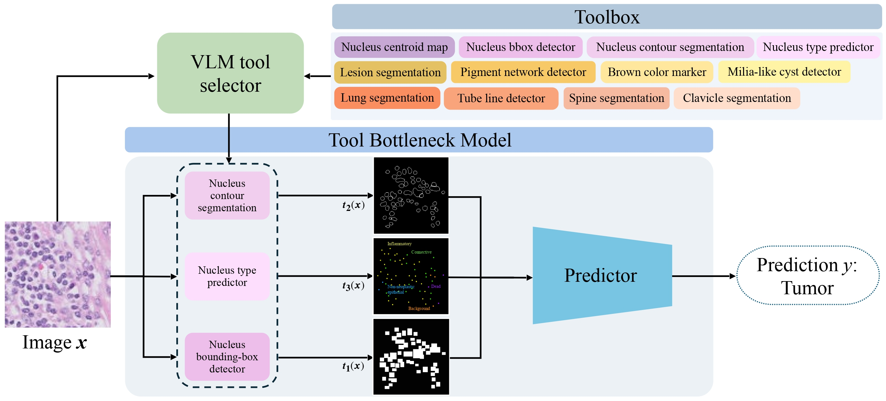

# A Tool Bottleneck Framework for Clinically-Informed and Interpretable Medical Image Understanding



Implementation from the paper:
>Christina Liu*, Alan Q. Wang*, Joy Hsu, Jiajun Wu, Ehsan Adeli, Tool Bottleneck Framework for Clinically-Informed and
Interpretable Medical Image Understanding. Under Review, 2025

**Tool Bottleneck Framework (TBF)** is a **tool-use pipeline for medical imaging** that pairs a vision-language model (VLM) with a **learned Tool Bottleneck Model (TBM)**. Instead of composing tools via text or code (which can miss **spatially localized** cues), TBF lets a VLM **select** clinically relevant tools for a given **image + task**, then the **TBM fuses the tool outputs as feature maps** and makes the final prediction. This yields **interpretable, clinically grounded** predictions and supports **arbitrary VLM selections** at test time.

**Key ideas:**
- **VLM-guided tool selection:** An off-the-shelf medical VLM routes each image to a subset of tools from a pre-specified toolbox.
- **Neural composition, not text composition:** Tool outputs (e.g., instances, masks, cues) are **rasterized into aligned `[C,H,W]` maps** and fused by the **TBM** (a small neural net), which is better suited to spatial signals than textual composition.
- **Robust to arbitrary/missing tools:** Training uses **tool dropout regimes** so the TBM can handle **any** VLM selection at inference.
- **Interpretable & clinically grounded:** Predictions are anchored in domain tools (e.g., nuclei segmentation, dermoscopic structures), enabling inspection and intervention.

**What this repository lets you do:**
1. **Run domain tools** (e.g., HoVer-Net) to produce per-image **tool outputs** (instances, masks, scores).
2. **Rasterize** tool outputs into **aligned feature maps** `[C, H, W]` (`.pt`) for learning.
3. Use the **VLM tool router** to select tools per **image + task** and save selections to CSV/JSONL.
4. **Train the TBM** with paper-aligned **dropout regimes** (Bernoulli/random, TBF w/ and w/o perturbation, All, Random-K) so the model stays reliable under **arbitrary** tool subsets.
5. **Infer** with the VLM-selected tools at test time—no text-based composition required.

## Setup and Installation

> Python 3.10+ recommended. GPU optional (CPU works for rasterization and small experiments).

```bash 
# 1) clone 
git clone https://github.com/christinaliu2020/tool-bottleneck-framework.git
cd tool-bottleneck-framework

# 2) create & activate a Conda environment
conda env create -f environment.yml
conda activate tbm-env

# 3) Editable install
pip install -e .
```

## Define and Use Your Own Tools
**Goal:** Run tools on your images and save outputs in a schema-declared format (e.g., `.dat`, `.npz`, `.json`). Add or modify tools in `tbm/tools.py` and optionally rasterize tool outputs to a desired format such as pixel feature map in `tbm/rasterizers.py`. 

Open `examples/tool_processing_example.ipynb` for examples of using/adding tools and rasterizing/saving tool outputs. 

To extend to your own tools, implement a `Tool` subclass and returns a `schema` string. Add a rasterizer branch that loads your format and returns a dict of feature maps. Update or create a `FeatureSpec` entry to declare channel orders/slices. Include your tool in the VLM toolbox for selection. 

## VLM Tool selection 
**Goal:** Prompt a medical VLM to select the most relevant tools per image for your task, and save the selections. These selections drive dropout regimes during training. Example:
```bash
python scripts/vlm_tool_selector.py \
  --mode batch \
  --dataset_dir /path/to/images \
  --task "Determine if there is tumor present in this histopathology patch." \
  --toolbox ALL \
  --top_k 3 \
  --out_jsonl outputs/vlm/selection.jsonl \
  --out_csv   outputs/vlm/selection.csv \
  --base http://<your-vllm-host>:<port>/v1 \
  --model google/medgemma-4b-it \
  --api_key EMPTY
```

## Training with Tool Dropout 
**Goal:** Train a classifier on rasterized features with a chosen dropout regime. Regimes are modular and read from `tbm/dropout_regimes.py`.
In the paper we refer to the models/regimes as:

| Paper name                                   | What it does (brief)                                                                 | CLI `--regime` (code) |
|----------------------------------------------|---------------------------------------------------------------------------------------|------------------------|
| **TBF without perturbation**                  | Use exactly the tools selected for each image (no stochastic masking).                | `exact`                |
| **TBF (with perturbation, $\alpha$ configurable)**   | Keep each selected tool with higher prob; unselected with lower/base prob.            | `informed`             |
| **Bernoulli (random)**                        | Keep each tool independently with the same probability across images.                 | `random`               |
| **Random top-k**                              | For each image, keep exactly `k` tools chosen uniformly at random.                    | `random_k`             |
| **TBF with all modality-specific tools**      | Keep all tools (no dropout).                                                          | `all`                  |
| **Global prior** *(ablation/variant)*         | Bernoulli per tool using global frequency estimated from VLM selections.              | `global`               |

> The **spec** you choose (via `--spec`) defines which channels correspond to which tools. VLM selections (CSV) are only needed for `exact`, `informed`, and `global`.

### Examples

**TBF with perturbation** 
Use `alpha` to interpolate between random (0) and fully VLM guided (1). `base_p` is the random keep probability when $\alpha$=0.
```bash
python train.py \
  --feature_root outputs/features \
  --csv_vlm outputs/vlm/selection.csv \
  --spec hovernet \
  --regime informed --alpha 1.0 --base_p 0.5 \
  --epochs 20 --batch 16 --lr 1e-4 --pretrained \
  --ckpt_dir checkpoints
```

**TBF without perturbation**
```bash
python train.py \
  --feature_root outputs/features \
  --csv_vlm outputs/vlm/selection.csv \
  --spec hovernet \
  --regime informed --alpha 1.0 --base_p 0.5 \
  --epochs 20 --batch 16 --lr 1e-4 --pretrained \
  --ckpt_dir checkpoints
```

**Bernoulli (random)** 
```bash
python train.py \
  --feature_root outputs/features \
  --spec hovernet \
  --regime random --p_keep 0.5 \
  --epochs 20 --batch 16 --lr 1e-4 --pretrained \
  --ckpt_dir checkpoints
```

**Random top-k**
```bash
python train.py \
  --feature_root outputs/features \
  --spec hovernet \
  --regime random_k --top_k 3 \
  --epochs 20 --batch 16 --lr 1e-4 --pretrained \
  --ckpt_dir checkpts_randomk
```
**TBF with all modality-specific tools**
```bash
python train.py \
  --feature_root outputs/features \
  --spec hovernet \
  --regime all \
  --epochs 20 --batch 16 --lr 1e-4 --pretrained \
  --ckpt_dir checkpoints_all
```
## Inference
**Goal:** Load a trained checkpoint and run predictions on rasterized feature tensors with VLM selected tools. 
```bash
python train.py \
  --feature_root outputs/features \
  --csv_vlm outputs/vlm/selection.csv \
  --regime exact \
  --infer_ckpt checkpoints/best_exact.pth \
  --infer_split test
```
## Quickstart 

```bash 
# Run example tools + rasterize (see notebook)
jupyter lab examples/tool_processing_example.ipynb

# Select tools with VLM (MedGemma)
python -m tbm.vlm_tool_selector --mode batch --task "..." \
  --dataset_dir /path/to/images --toolbox ALL --top_k 3 \
  --out_csv outputs/vlm_selections.csv

# 3) Train with a dropout regime
python -m tbm.train --features_root examples/outputs/features \
  --train_csv outputs/vlm_selections.csv --spec hovernet \
  --regime informed --epochs 20 --batch 16

# 4) Inference
python -m tbm.infer --features_root examples/outputs/features \
  --spec hovernet --ckpt checkpoints/best_exact.pth --out_csv outputs/preds.csv
```

## Citation
If you find this framework useful, please consider citing: 
